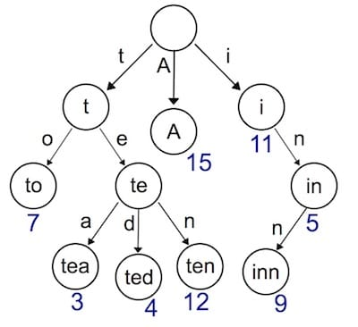

## Day3 Router

- **使用 Trie 树实现动态路由(dynamic route)解析**
- **支持两种模式`:name`和*`filepath`**

### Trie 树简介
之前，我们用了一个非常简单的`map`结构存储了路由表，使用`map`存储键值对，索引非常高效，但是有一个弊端，键值对的存储的方式，只能用来索引静态路由。那如果我们想支持类似于`/hello/:name`这样的动态路由怎么办呢？所谓动态路由，即一条路由规则可以匹配某一类型而非某一条固定的路由。例如`/hello/:name`，可以匹配`/hello/Hud`、`hello/Monica`等。

动态路由有很多种实现方式，支持的规则、性能等有很大的差异。例如开源的路由实现`gorouter`支持在路由规则中嵌入正则表达式，例如`/p/[0-9A-Za-z]+`，即路径中的参数仅匹配数字和字母；另一个开源实现`httprouter`就不支持正则表达式。著名的Web开源框架gin 在早期的版本，并没有实现自己的路由，而是直接使用了`httprouter`，后来不知道什么原因，放弃了`httprouter`，自己实现了一个版本。

<div align=center></div>
    
实现动态路由最常用的数据结构，被称为前缀树(Trie树)。看到名字你大概也能知道前缀树长啥样了：每一个节点的所有的子节点都拥有相同的前缀。这种结构非常适用于路由匹配，比如我们定义了如下路由规则：

- /:lang/doc

- /:lang/tutorial

- /:lang/intro

- /about

- /p/blog

- /p/related

我们用前缀树来表示，是这样的:

<div align=center></div>

`HTTP`请求的路径恰好是由/分隔的多段构成的，因此，每一段可以作为前缀树的一个节点。我们通过树结构查询，如果中间某一层的节点都不满足条件，那么就说明没有匹配到的路由，查询结束。

接下来我们实现的动态路由具备以下两个功能:

- 参数匹配:。例如 `/p/:lang/doc`，可以匹配 `/p/c/doc `和 `/p/go/doc`
- 通配*。例如 `/static/*filepath`，可以匹配`/static/fav.ico`，也可以匹配/`static/js/jQuery.js`，这种模式常用于静态服务器，能够递归地匹配子路径。

### Trie 树实现

首先我们需要设计树节点上应该存储那些信息

```go
type node struct {
	pattern  string // 待匹配路由，例如 /p/:lang
	part     string // 路由中的一部分，例如 :lang
	children []*node // 子节点，例如 [doc, tutorial, intro]
	isWild   bool // 是否精确匹配，part 含有 : 或 * 时为true
}
```
与普通的树不同，为了实现动态路由匹配，加上了isWild这个参数。即当我们匹配 /p/go/doc/这个路由时，第一层节点，p精准匹配到了p，第二层节点，go模糊匹配到:lang，那么将会把lang这个参数赋值为go，继续下一层匹配。我们将匹配的逻辑，包装为一个辅助函数。

```go
// 第一个匹配成功的节点，用于插入
func(n *node) matchChild(part string) *node {
	for _, child := range n.children {
		if child.part == part || child.isWild {
			return child
		}
	}
	return nil
}
// 所有匹配成功的节点，用于查找
func(n *node) matchChildren(part string) []*node {
	nodes := make([]*node, 0)
	for _, child := range n.children {
		if child.part == part || child.isWild {
			nodes = append( nodes, child)
		}
	}
	return nodes
```

对于路由来说，最重要的当然是注册与匹配了。开发服务时，注册路由规则，映射`handler`；访问时，匹配路由规则，查找到对应的`handler`。因此，`Trie` 树需要支持节点的插入与查询。插入功能很简单，递归查找每一层的节点，如果没有匹配到当前`part`的节点，则新建一个，有一点需要注意，`/p/:lang/doc`只有在第三层节点，即`doc`节点，`pattern`才会设置为`/p/:lang/doc`。`p`和`:lang`节点的`pattern`属性皆为空。因此，当匹配结束时，我们可以使用`n.pattern` == `=`来判断路由规则是否匹配成功。例如，`/p/python`虽能成功匹配到`:lang`，但`:lang`的`pattern`值为空，因此匹配失败。查询功能，同样也是递归查询每一层的节点，退出规则是，匹配到了`*`，匹配失败，或者匹配到了第`len(parts)`层节点。

```go
func (n *node) insert(pattern string, parts []string, height int) {
	if len(parts) == height {
		n.pattern = pattern
		return
	}

	part := parts[height]
	child := n.matchChild(part)
	if child == nil {
		child = &node{part: part, isWild: part[0] == ':' || part[0] == '*'}
		n.children = append(n.children, child)
	}
	child.insert(pattern, parts, height+1)
}

func (n *node) search(parts []string, height int) *node {
	if len(parts) == height || strings.HasPrefix(n.part, "*") {
		if n.pattern == "" {
			return nil
		}
		return n
	}

	part := parts[height]
	children := n.matchChildren(part)

	for _, child := range children {
		result := child.search(parts, height+1)
		if result != nil {
			return result
		}
	}

	return nil
}
```

### Router
`Trie` 树的插入与查找都成功实现了，接下来我们将 `Trie` 树应用到路由中去吧。我们使用 `roots` 来存储每种请求方式的 `Trie` 树根节点。使用 `handlers` 存储每种请求方式的 `HandlerFunc` 。`getRoute` 函数中，还解析了`:`和`*`两种匹配符的参数，返回一个 `map` 。例如 `/p/go/doc匹配到/p/:lang/doc` ，解析结果为：`{lang: "go"}`，`/static/css/geektutu.css` 匹配到 `/static/*filepath` ，解析结果为`{filepath: "css/geektutu.css"}`。


